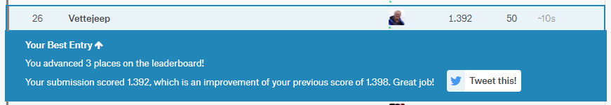

# MSDS696 Masters Final Project
---
## Kaggle LANL Earthquake Prediction Challenge
### Machine Learning using LightGBM and XGBoost
---
### Final Project for a Masters Degree in Data Science at [Regis University](https://www.regis.edu), Denver, CO  
### Please see the Jupyter notebooks for Exploratory Data Analysis and Modeling
### Links:
### [Exploratory Data Analysis](https://github.com/Vettejeep/MSDS696-Masters-Final-Project/blob/master/earthquake_eda.ipynb)
### [Machine Learning Modeling](https://github.com/Vettejeep/MSDS696-Masters-Final-Project/blob/master/earthquake_model.ipynb)
### [YouTube Video Presentation Link](https://youtu.be/HR0ppRIkq1o)
### [Follow the conversation on Kaggle](https://www.kaggle.com/vettejeep/masters-final-project-model-lb-1-392)
---
### Kaggle Placing at End of Modeling for the Class Project - Top 1% Score at time of project end!
#### Note that the competition continued after my degree project was finished and competitors had access to my work due to its being published on Kaggle.  Still, the project was awarded a top 6% placing and a Kaggle Bronze medal. 
  

##### Note: Placing as of April 28th - competition is ongoing so placing will change and probably go down. And, since university rules require publishing on the web, any value of this work is fully available to competitors on Kaggle.
---
### Kevin Maher    
### Vettejeep365@gmail.com    
